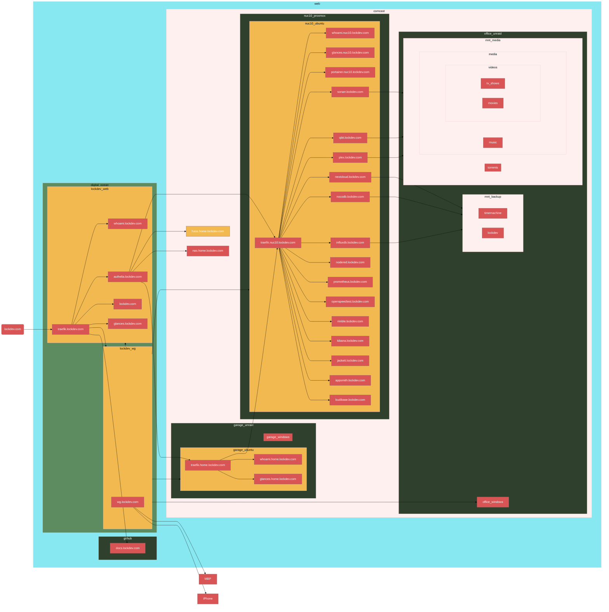

# Architecture diagram

```mermaid
%%{init: {'theme': 'base', 'themeVariables': { 'primaryColor': '#D95555', 'primaryTextColor': '#FFFFFF', 'edgeLabelBackground':'#D95555', 'tertiaryColor': '#fff0f0'}}}%%

flowchart LR
  subgraph web
    subgraph web_pad [ ]
    
      subgraph github
        docs.lockdev.com
      end

      subgraph digital_ocean
          
          subgraph lockdev_web
            traefik.lockdev.com --> whoami.lockdev.com
            traefik.lockdev.com --> authelia.lockdev.com
            traefik.lockdev.com --> lockdev.com
            traefik.lockdev.com --> glances.lockdev.com
            authelia.lockdev.com
            lockdev.com
            
          end

          subgraph lockdev_wg
            wg.lockdev.com
          end

          traefik.lockdev.com --> lockdev_wg
      end
      subgraph comcast        
          subgraph garage_unraid
            subgraph garage_unraid_pad [ ]
              subgraph garage_ubuntu
                traefik.home.lockdev.com --> whoami.home.lockdev.com
                
                traefik.home.lockdev.com --> glances.home.lockdev.com
              end
              
              subgraph garage_windows
              end
            end
          end
          authelia.lockdev.com --> hass.home.lockdev.com
          authelia.lockdev.com --> nas.home.lockdev.com
          authelia.lockdev.com --> traefik.home.lockdev.com
          authelia.lockdev.com --> traefik.nuc10.lockdev.com
          traefik.lockdev.com --> docs.lockdev.com
          
          subgraph nuc10_proxmox
            subgraph nuc10_proxmox_pad [ ]
              subgraph nuc10_ubuntu
                traefik.nuc10.lockdev.com --> whoami.nuc10.lockdev.com
                traefik.nuc10.lockdev.com --> glances.nuc10.lockdev.com
                traefik.nuc10.lockdev.com --> portainer.nuc10.lockdev.com
                traefik.nuc10.lockdev.com --> sonarr.lockdev.com
                traefik.nuc10.lockdev.com --> qbit.lockdev.com
                traefik.nuc10.lockdev.com --> plex.lockdev.com
                traefik.nuc10.lockdev.com --> nextcloud.lockdev.com
                traefik.nuc10.lockdev.com --> nocodb.lockdev.com
                traefik.nuc10.lockdev.com --> influxdb.lockdev.com
                traefik.nuc10.lockdev.com --> nodered.lockdev.com
                traefik.nuc10.lockdev.com --> prometheus.lockdev.com
                traefik.nuc10.lockdev.com --> openspeedtest.lockdev.com
                traefik.nuc10.lockdev.com --> rimble.lockdev.com
                traefik.nuc10.lockdev.com --> kibana.lockdev.com
                traefik.nuc10.lockdev.com --> jackett.lockdev.com
                traefik.nuc10.lockdev.com --> appsmith.lockdev.com
                traefik.nuc10.lockdev.com --> budibase.lockdev.com
              end
            end
          end

          subgraph office_unraid
            office_windows
            
            subgraph mnt_backup
              subgraph mnt_backup_pad [ ]
                timemachine
                lockdev
              end
            end
            subgraph mnt_media
              subgraph mnt_media_pad [ ]
                subgraph torrents
                end
              
                subgraph media
                  subgraph media_pad [ ]
                    subgraph videos
                      subgraph videos_pad [ ]
                        tv_shows
                        movies
                      end
                    end
                  end
                  music
                end
              end
                
            end

            sonarr.lockdev.com --> mnt_media
            qbit.lockdev.com --> mnt_media
            plex.lockdev.com --> mnt_media
            nextcloud.lockdev.com --> mnt_backup
            nocodb.lockdev.com --> mnt_backup
            influxdb.lockdev.com --> mnt_backup
          end
          
          traefik.home.lockdev.com --> traefik.nuc10.lockdev.com
          
      end
    end
  end


  A(lockdev.com) --> traefik.lockdev.com
  wg.lockdev.com --> MBP
  wg.lockdev.com --> iPhone

  
  lockdev_wg --> lockdev_web
  lockdev_wg --> garage_ubuntu
  lockdev_wg --> nuc10_ubuntu
  lockdev_wg --> office_windows

  click A "https://lockdev.com/" "lockdev.com" _blank
  click lockdev.com "https://lockdev.com" _blank
  click traefik.lockdev.com "https://traefik.lockdev.com" _blank
  click glances.lockdev.com "https://glances.lockdev.com" _blank
  click whoami.lockdev.com "https://whoami.lockdev.com" _blank
  click docs.lockdev.com "https://docs.lockdev.com" _blank
  click hass.home.lockdev.com "https://hass.home.lockdev.com" _blank
  click traefik.home.lockdev.com "https://traefik.home.lockdev.com" _blank
  click glances.home.lockdev.com "https://glances.home.lockdev.com" _blank
  click whoami.home.lockdev.com "https://whoami.home.lockdev.com" _blank
  
  click traefik.nuc10.lockdev.com "https://traefik.nuc10.lockdev.com" _blank
  click whoami.nuc10.lockdev.com "https://whoami.nuc10.lockdev.com" _blank
  click glances.nuc10.lockdev.com "https://glances.nuc10.lockdev.com" _blank
  click portainer.nuc10.lockdev.com "https://portainer.nuc10.lockdev.com" _blank
  click sonarr.lockdev.com "https://sonarr.lockdev.com" _blank
  click qbit.lockdev.com "https://qbit.lockdev.com" _blank
  click plex.lockdev.com "https://plex.lockdev.com" _blank
  click budibase.lockdev.com "https://budibase.lockdev.com" _blank
  click appsmith.lockdev.com "https://appsmith.lockdev.com" _blank

  %% Defining node styles
    classDef Blue fill:#88E8F2;
    classDef Green	fill:#5E8C61;
    classDef Dark_green fill:#2F402C,color:#FFFFFF;
    classDef Yellow fill:#F2B950;
    classDef Red fill:#D95555,color:#FFFFFF;
    classDef Padding fill:none,stroke:none;
  %% Assigning styles to nodes
    class web Blue;
    class digital_ocean,comcast Green;
    class github,garage_unraid,nuc10_proxmox,office_unraid Dark_green;
    class lockdev_web,lockdev_wg,garage_ubuntu,nuc10_ubuntu,hass.home.lockdev.com Yellow;
    class A Red;
    class web_pad,garage_unraid_pad,nuc10_proxmox_pad,mnt_backup_pad,mnt_media_pad,media_pad,videos_pad Padding;
```