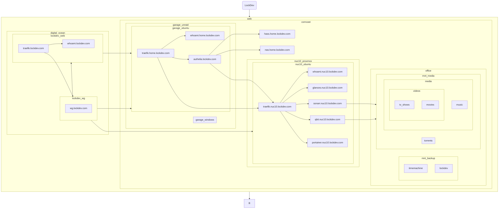

# Architecture diagram

```mermaid
flowchart TB
  subgraph web
    direction LR
    subgraph digital_ocean
        direction TB
        subgraph lockdev_web
          traefik.lockdev.com --> whoami.lockdev.com
        end

        subgraph lockdev_wg
          wg.lockdev.com
        end

        traefik.lockdev.com --> lockdev_wg
    end
    subgraph comcast
        direction TB
        subgraph garage_unraid
            subgraph garage_ubuntu
              direction TB
              traefik.home.lockdev.com --> whoami.home.lockdev.com
              traefik.home.lockdev.com --> authelia.lockdev.com
            end
            
            subgraph garage_windows
            end
        end
        authelia.lockdev.com --> hass.home.lockdev.com
        authelia.lockdev.com --> nas.home.lockdev.com
        authelia.lockdev.com --> traefik.nuc10.lockdev.com
        
        subgraph nuc10_proxmox
          subgraph nuc10_ubuntu
            direction LR

            traefik.nuc10.lockdev.com --> whoami.nuc10.lockdev.com
            traefik.nuc10.lockdev.com --> glances.nuc10.lockdev.com
            traefik.nuc10.lockdev.com --> sonarr.nuc10.lockdev.com
            traefik.nuc10.lockdev.com --> qbit.nuc10.lockdev.com
            traefik.nuc10.lockdev.com --> portainer.nuc10.lockdev.com
          end

          
        end

        subgraph office
          direction TB
          subgraph mnt_backup
            timemachine
            lockdev
          end
          subgraph mnt_media
            direction LR
            subgraph torrents
            end
            subgraph media
              subgraph videos
                tv_shows
                movies
              end
              music
            end
              
          end

          sonarr.nuc10.lockdev.com --> mnt_media
          qbit.nuc10.lockdev.com --> mnt_media
        end
        
        traefik.home.lockdev.com --> traefik.nuc10.lockdev.com
        
    end
  end
  A(LockDev) --> web --> B
  lockdev_web --> garage_ubuntu
  lockdev_wg --> lockdev_web
  lockdev_wg --> garage_ubuntu
  lockdev_wg --> nuc10_ubuntu

  click A "https://lockdev.com/" "lockdev.com" _blank
```