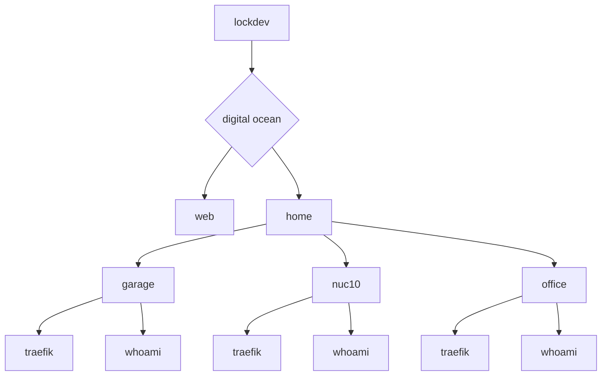

# Architecture diagram

```mermaid
graph TD
    A[lockdev] -->C{digital ocean}
    C -->D[web]
    C -->E[home]
    E -->F[garage]
    F -->F1[traefik]
    F -->F2[whoami]
    E -->G[nuc10]
    G -->J[traefik]
    G -->K[whoami]
    E -->H[office]
    H -->H1[traefik]
    H -->H2[whoami]
    
    click A "https://lockdev.com" "docs home"
    click B "https://lockdev.com/" "lockdev.com" _blank
    click C "https://traefik.lockdev.com/" "home" _blank
```