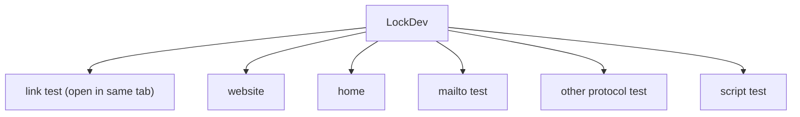

# Network diagram

```mermaid
graph TB
    TITLE["LockDev"]
    A["link test (open in same tab)"]
    B["website"]
    C["home"]
    D[mailto test]
    E[other protocol test]
    F[script test]
    TITLE --> A & B & C & D & E & F
    click A "https://mermaid-js.github.io/mermaid/#/" "link test (open in same tab)"
    click B "https://lockdev.com/" "lockdev.com" _blank
    click C "https://traefik.lockdev.com/" "home" _blank
    click D "mailto:user@user.user" "mailto test"
    click E "notes://do-your-thing/id" "other protocol test"
    click F "javascript:alert('test')" "script test"

```