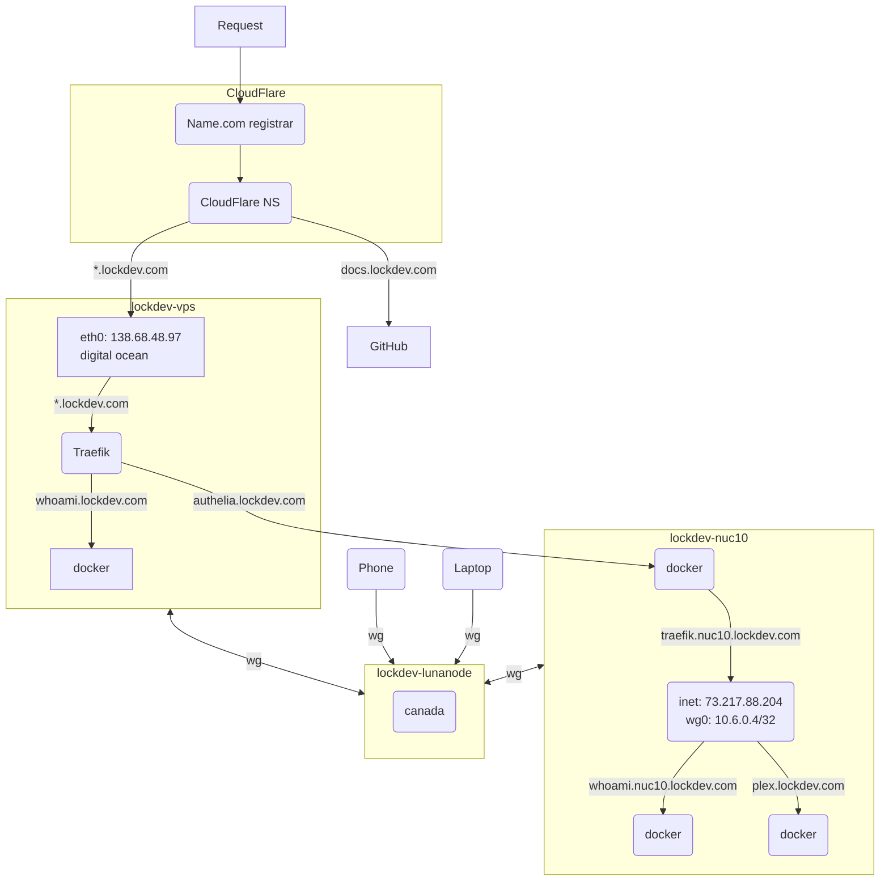

# Wireguard and Traefik

```mermaid
flowchart TB
    A[Request] --> B(Name.com registrar)

    subgraph CloudFlare
        B --> C(CloudFlare NS)
    end
    

    subgraph aa[lockdev-nuc10]
        H -->|traefik.nuc10.lockdev.com| I(inet: 73.217.88.204<br />wg0: 10.6.0.4/32)
        I -->|whoami.nuc10.lockdev.com| J(docker)
        I -->|plex.lockdev.com| K(docker)        
    end


    subgraph bb[lockdev-vps]
        C -->|*.lockdev.com| E[eth0: 138.68.48.97<br>digital ocean]
        E -->|*.lockdev.com| G(Traefik)
        G -->|whoami.lockdev.com| docker
        G -->|authelia.lockdev.com| H(docker)
    end


    subgraph cc[lockdev-lunanode]
        c(canada)
    end

    C -->|docs.lockdev.com| F[GitHub]

    bb <--> |wg| cc
    aa <--> |wg| cc


    D2(Phone) -->|wg| cc
    D3(Laptop) -->|wg| cc

    
style E text-align:left
```